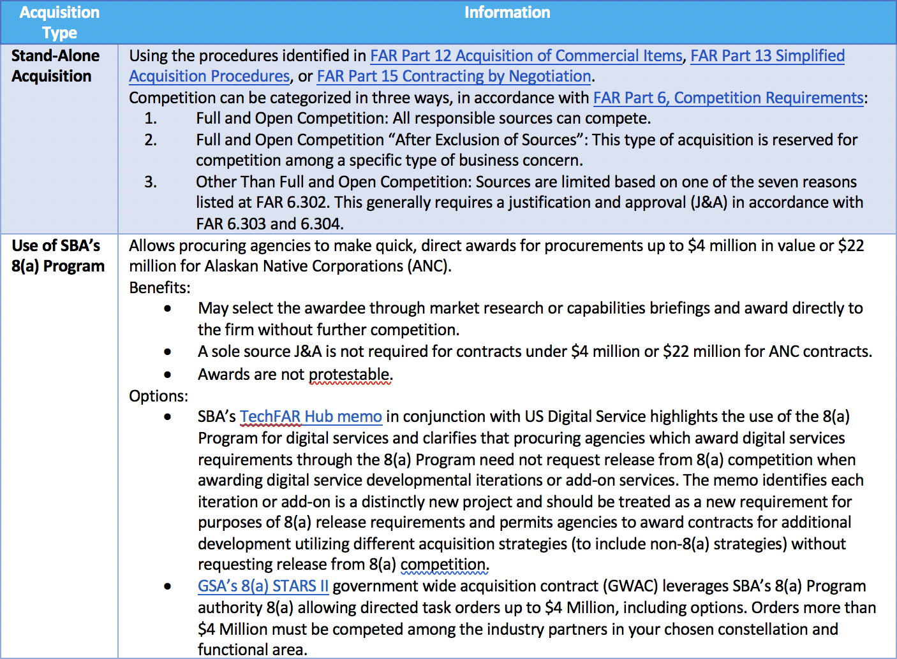
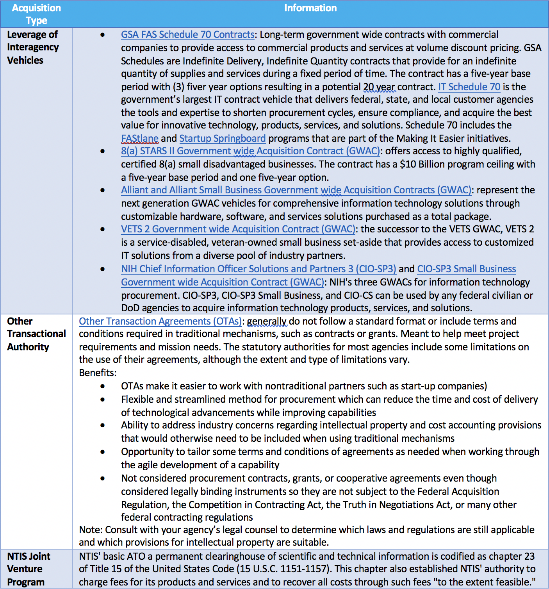

# Appendix G – Sample Friendly Contract Vehicles – Refer to GSA Atlas [3]
When procuring blockchain or DLT, agencies should consider agile acquisition methods. Agile acquisition advocates rolling out capabilities in smaller chunks, more frequently. It also deemphasizes extensive upfront capabilities planning. Instead developers put capabilities into action as soon as possible, then modify and adapt them as needed. Agile acquisition allows programs to be more responsive to changes in operations, technology, and budgets. It also offers more opportunities for collaborating with users and other stakeholders to deliver priority capabilities rapidly. Implementing agile development practices often requires changes in an agency's policies, processes, and culture. But the rewards are ample.

Traditional procurement methods for waterfall software implementations lack the flexibility to take advantage of the benefits of time, schedule, and cost that agile software development methods bring to the Federal Government. For this reason, the acquisition workforce needs to make its processes agile, using innovative and creative solutions to procure IT services while maintaining compliance with the Federal Acquisition Regulation (FAR) and Federal law. For more information on agile acquisitions, please see FAI’s Agile Acquisition 101 [11].

The table below provides a list of possible acquisition vehicles that can be used to procure blockchain:

