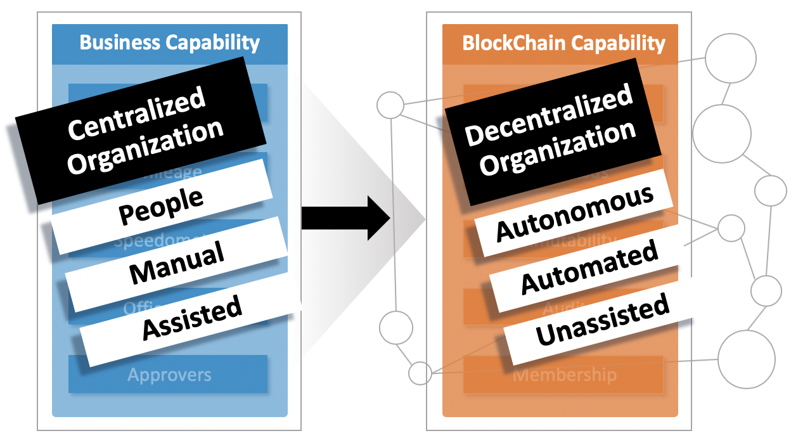
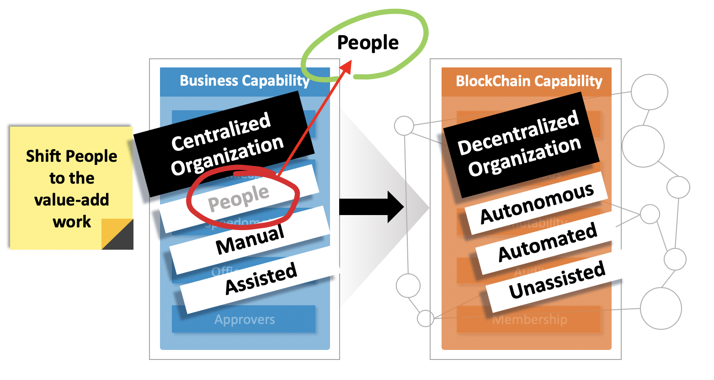
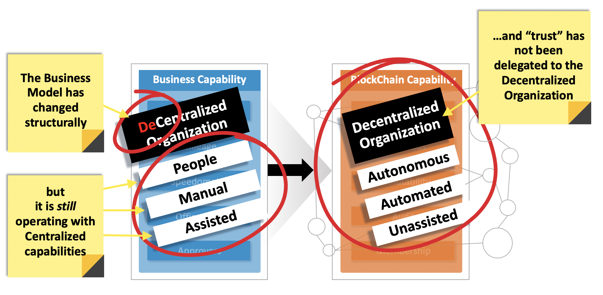

# Appendix H – Decentralized Organizations
Today’s business model is typically based upon a centralized hiearchy. This conflicts with the value of digital platforms. Team members become burdened with having to assist manual processes.

_Figure 1: transformation - centralized-to-decentralized - [expand](../../assets/img/playbook/pb-dec-org-1.png){:target="_blank"}_

By shifting to a decentralized organization, the most important asset – people – are freed from timely manual operations, and can be re-purposed to value-add activities.

_Figure 2: let technology do the routine work - [expand](../../assets/img/playbook/pb-dec-org-2.png){:target="_blank"}_

Even when an organization is physically structured in a decentralized format, it can still be operating in the older model. In this example, ‘Trust’ of enforcing rules automatically does not exist.

_Figure 3: transformation - decentralized-to-decentralized - [expand](../../assets/img/playbook/pb-dec-org-3.png){:target="_blank"}_