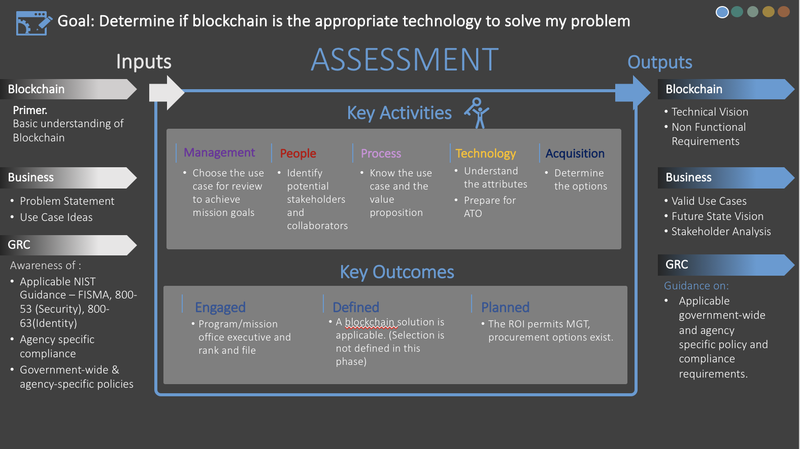
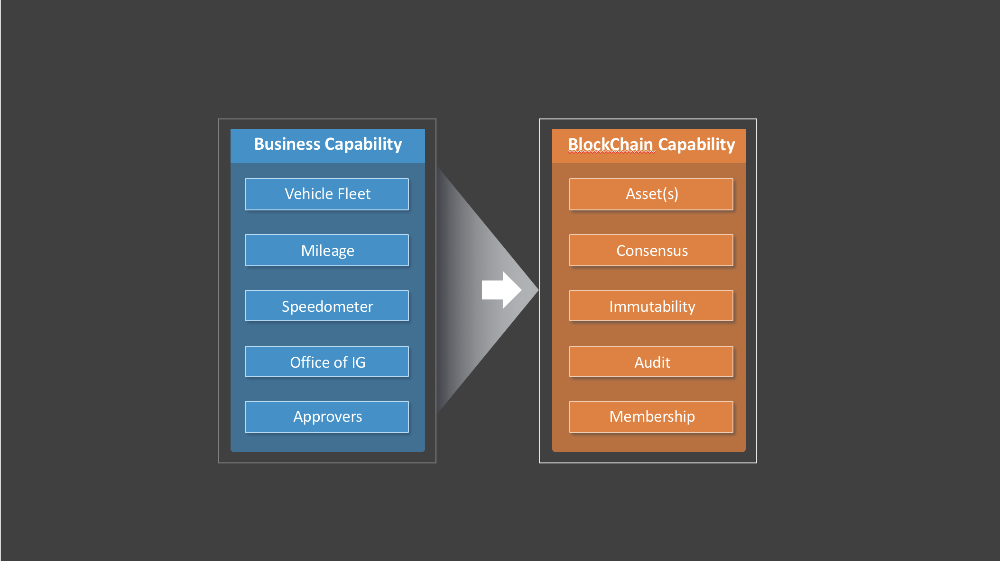

# Phase 1 - Problem Assessment
This section helps decision makers create the most value through their blockchain initiative. It includes tools to ensure the initiative is designed for addressing a specific use case and advancing toward mission goals, even if that solution is not blockchain. 

## Phase Inputs
When it comes to emerging technologies, business decision makers are faced with making a choice: keep the status quo or evolve the organization’s culture to be able to leverage these new solutions. It is a challenge that goes beyond the definition of these technologies; it includes analysis of “How does this technology change and improve my business?”
 
Today, most businesses operate in a hierarchal manner. Models have hardly changed – adapted or evolved – for the last two decades. Digitalization has created the opportunity to morph business models from linear to dynamic, asymmetric and 3-dimensional. However, people and culture have struggled to keep pace with these advances. 
 
Blockchain is the catalyst for tectonic shift in the accepted business model: decentralized organizations. Successful organizations and leaders are those who are able to transcend the status quo and master this reality, combining a focus on the organization’s core competency with optimizing operational expenses (OPEX). Executives need to prepare their leaders, associates, and culture for such adoption. 
 
To fully assess opportunities in blockchain, engage with stakeholders to refine the use case the blockchain initiative will address. Identify and document the context of the use case. This includes the business challenge; business process issues, gaps, and/or frictions that contribute to that challenge; and stakeholder needs. Detail the stakeholders’ functional requirements. Also, determine their perceived risks related to implementing a solution along with their expected outcomes and the associated metrics. 

_Figure 3: assessment phase (1) summary_

## “Do I need a blockchain?” 
When considering a blockchain solution, evaluate both the associated potential benefits and limitations, such as whether a blockchain solution will remove some of the existing business frictions associated with the current business process. Determine if characteristics, such as trust, immutability and finality, provide significant value for the use case being evaluated. Assess whether those benefits result in a reduction in cost and/or risk, or if they will achieve process efficiencies. Analyze if there are additional benefits that can be realized by growing the business network associated with the solution.
 
As the industry considers the new model of decentralized organizations, consider whether executives are ready for the massive shift to the automatic execution of activities without human intervention. Also determine the qualifying factors of decentralized organizations, such as the rules and regulations that need to be adhered to and how the blockchain solution may integrate with existing systems. 
 
The following are key questions to consider when evaluating a blockchain solution. (Note that a discussion regarding public versus permissioned blockchain is provided in the Phase Three: Technology Selection section of the playbook.) Review and answer each question. Add or subtract the points associated with each question to determine your total score. Point totals will provide insight into the possibility you may get a substantial Return on Investment (ROI) from a blockchain approach.
 
**Note:** This is a notional table and the level of importance associated with each question may be tied to the use case being assessed. Assign Points based on the Attribute Importance Rank (with suggested weighting). You may adjust the weight of questions as they apply to your use case. (5 – critical, 4 – very high, 3 – high, 2 – moderate, 1 – slightly, 0 – not at all) 

<form lpformnum="1">
    <ol>
        
        <li>
            <b>{{quest.question-title}}</b> {{quest.question-description}}
             
            <fieldset class="usa-fieldset-inputs usa-offset-one-twelfth">    
                <ol class="usa-unstyled-list">
                    
                    <li class="answer">
                        <input id="{{ rb.id }}" type="radio" name="{{ quest.question }}" value="{{rb.value}}"  checked >
                        <label for="{{ rb.id }}">{{ rb.label }}</label>
                    </li>
                    
                </ol>
            </fieldset>
        </li>
        
    </ol>
</form>

### Results
Provided here are common questions and relative weights for answers to serve as a preliminary guide for those considering a blockchain approach. While useful, this is still only a guide for consideration and further investigation. Sound engineering analysis and practices should still prevail. 

**Score Groupings:** In order to assess the applicability of a blockchain approach, we have grouped scores to guide the reader to where taking a blockchain approach would be most beneficial (highest score) and where it is less likely (but still may be applicable, just needs more scrutiny).

**If your score is 20 or below:** A score of 20 or below typically represents a small ROI and limited applicability from a blockchain approach. Consider that while the score may be low, your situation may still warrant deeper analysis as there can be a compelling reason to continue with a blockchain approach that did not fall into the standard categorization. 

**If your score is between 21 and 40:** A score of between 21 and 40 could typically be supported with a blockchain approach but isn’t an overwhelming natural candidate. These situations can have powerful reasons that can still drive a blockchain approach, yet they might also have mitigating factors that make a traditional approach a better alternative. In these situations, a more thorough analysis is typically needed.

**If your score is 41 or higher:** A score above 41 typically represents a compelling ROI and strong applicability that would benefit significantly from a blockchain approach. It is strongly recommended to consider the costs and benefits of a blockchain approach in these instances while still considering other additive and mitigating factors in the organization, strategic direction, interdependencies, and related items. 

## Practical Advice and Best Practices for Blockchain Assessment
With blockchain near the top of the hype cycle in 20172, it is important to separate reality from the hype when it comes to which uses cases can actually benefit from a blockchain solution. Consider the following advice and best practices when evaluating blockchain for any use case.
 
### Start Small - Implement a Minimal Viable Product(MVP)/Prototype 
Before addressing how to introduce this new technology into your ecosystem, define the scope of an MVP/proof of concept that demonstrates blockchain as a viable solution for your use case. Do this while still considering the future state and stakeholder incentives. The MVP should help prove the solution’s expected outcomes (e.g. decreased reconciliation costs) associated with the MVP hypothesis.

### Business Capabilities and Blockchain Capabilities
Consider mapping your business capabilities to your blockchain capabilities. Below is an example of a General Services Administration (GSA) vehicle fleet model. The stakeholders need to track mileage of vehicles usage across various agencies users, and states. This alignment serves two purposes: 1) Stakeholders are aware of which business capabilities they plan on transforming, and 2) Blockchain [capabilities] are validated as the correct emerging technology for the business solution.

_Figure 4: alignment - business-to-business blockchain_

### Build Blockchain Architectural Blueprint for Future Phases
Develop a vision and a plan for the additional requirements and challenges that will need to be addressed if your solution moves into a pilot phase and subsequent operational phases. This should encompass modernization and integration with legacy systems. The project will also include major change management components both from an operational and cultural perspective. 

The organization should examine the desired technologies and subsequent capabilities that can be enabled by the future state blockchain solution. For example, an operational blockchain logging security events may be combined with artificial intelligence as part of a new capability that is a predictive cybersecurity force multiplier. Or a blockchain for supply chain may become the entry point to a property management workflow solution. 

Building a working blueprint of the technical architecture will provide a powerful tool for defining the scope and phases of the comprehensive blockchain implementation. Strategic scaling will enable you to optimally address pain points and align stakeholders while tackling one priority area at a time to ultimately accomplish transformational objectives and advance mission goals.

### Emphasize ROI and benefits to the entire network 
Emphasize ROI while making an assessment. Examine the solution's common costs, benefits, and efficiencies for both the network as a whole and for individual members. Include design thinking based on personas and a prioritization matrix around value vs. complexity. An MVP should prove the viability of a blockchain solution, with ROI measured by gains in savings and in efficiencies, reduction of risk, and the meeting of mission goals. ROI considerations should include:
- Gains in efficiency and cost savings – Learn how much effort and cost are currently spent on reconciliation to determine how the trust provided by a blockchain solution when exchanging data or assets impacts ROI.
- Incremental gains – Implementation should be done in small increments, keeping to a true agile methodology. This is not a lift and replace but a gradual shift to a strategically-assured, positive ROI.
- Cloud first and shared services – Blockchain relies on distributed computing concepts where nodes may reside in the cloud. Blockchain smart contracts can enable vendor provided shared services to demonstrate adherence to current regulations and policies while providing an immutable audit trail.
- Reducing risk – Understand the ROI that blockchain can provide by reducing risk. A blockchain solution can help reduce the risk associated with tampering and Denial of Service (DoS) attacks due to its decentralized, tamper-resistant attributes.
- Other – How does the trust provided by a blockchain solution when exchanging data or assets impact ROI? How much effort and cost are currently spent on reconciliation?

## Impact of Modernizing Government Technology (MGT) Act
The MGT Act4 (incorporated as Subtitle G to Title X of the National Defense Authorization Act for Fiscal Year 2018) encourages agencies to take a refined strategic and incremental approach to IT with the goals of driving gains of efficiency and cost savings, as well as lowering risk. If an agency has targeted an IT process to modernize, but does not have the budget to do so, adoption of new technology, such as blockchain, can be used to enhance the existing IT solution with new capabilities and functionality.

This could be applied as part of a strategy enabled by the act to use working capital funds to spur IT modernization. By choosing a smaller project or projects that will realize savings in year one, the agency can apply those savings (which can be banked for up to three years) to the larger, more critical project in year two.

Since it is centered on multiagency business networks and processes, adoption of blockchain technology is consistent with the MGT Act’s approach to modernization. A strategic blockchain solution is extensible – able to grow over time, adding new members and processes to the business network. It also facilitates data sharing and the reduction of existing frictions and inefficiencies. Therefore, the assessment that an agency must make through a standard analysis of functions and gaps is to determine if the use of a blockchain will enhance an existing solution through gains of efficiency, cost savings and lowered risk.
 
### Incorporate Regulations/Mandates
When assessing blockchain or any blockchain technology, be sure to evaluate it within the context your particular use case. For example, an identity use case would require a technology that adheres to particular regulations, such as the technical requirements in the NIST 800-63, Digital Identity Suite5, Digital Identity Guidelines. Be sure to evaluate the entire technology solution—including smart contracts, oracles, side chains, micro services, any associated cryptocurrencies, etc.—with regard to industry standards, technical standards, regulations, acts, and common law.

### Determine Throughput and Latency Requirements of Business Processes
Understanding data requirements and the speed by which data transactions must occur within the blockchain ecosystem are key inputs in determining your optimal architecture, accelerators, etc. When assessing blockchain as a solution, consider the number of TPS required, the size of the data/digital assets being transferred, if the data is highly transactional, and whether the data should be stored on or off the blockchain. Determine where the nodes will be located. Assess if the network bandwidth is constricted and the resulting implications. Large blockchain ecosystems with many systems and players such as public permissionless chains would be best served by minimizing data-load, whereas smaller private/consortium chains may handle a larger number of TPS and can theoretically handle the exchange of larger “blocks” without interruption to business processes.

### Assess the Current State of the Customer Experience
As with most transformative efforts, the blockchain initiative should also be leveraged as an opportunity to enhance user experience. When assessing your use case, different users with different roles may interact with the proposed solution. Users have little tolerance for solutions/systems that lack user-friendliness, intuitiveness, and/or accessibility. Involve them early and apply their feedback while assessing how blockchain could elevate those user experiences by automating tasks and improving visibility. Robust usability testing will be key to maintaining the momentum of successful user adoption as the blockchain solution is scaled outward.

## Outcomes
After the assessment is completed, one or more deliverables/outcomes should be produced:
- One or more use cases identified as candidates for a blockchain solution. Each use case should be evaluated against assessment criteria to determine if a blockchain can be used to realize gains such as cost saving, efficiency, or reduced risk. Which of these use cases would be sensible to implement as a minimum viable product?
- Documentation on the key stakeholders, network participants and their roles for your candidate use case. How will a blockchain solution will impact your stakeholders? What are the incentives for these stakeholders to participate in the solution?
- For each candidate use case, identify what business frictions you are looking to address by implementing the solution. Do blockchain attributes help to address those frictions? This list should correlate with the list of anticipated benefits provided by the solution. Both the frictions and benefits may differ for each stakeholder.
- List of federal regulations, government-wide and agency policies, Federal Information Security Management Act (FISMA) and other required compliance regarding adoption and implementation of the solution, these may include existing rules and regulations, data ownership, data location, process ownership, and a stakeholder management plan to account for resistance from individual stakeholders.
- A list of performance and other non-functional requirements such as security and scalability. They may serve as barriers to the implementation.
- Documentation of the existing systems and data sources which may interact with the proposed solution. Examine the integration challenges when interacting with those systems. Could implementation of the solution lead to retirement of a legacy system?
- A model of what the operational end state would be after implementing a blockchain solution. This should be done initially for the MVP/PoC and again for a solution once the scope has been expanded. What should the outcomes be after implementing this solution? 
- With the operational end state identified, a list of the anticipated benefits. 
- Documentation regarding alternative solutions including a list that identifies the pros and cons associated with alternative solutions.
- Documentation regarding existing assets and/or licenses which may be required for the use case. Are there entitlements associated with those assets?

## Phase Outputs
The artifacts generated during the assessment phase, such as the documented use case, the stakeholder analysis, the vision of the operational end state, and other deliverables, directly support and should be leveraged during the Readiness Phase. 

## Decision Gate
If your score is 41 and above, it is highly recommended to commence the Playbook readiness review.

If your score is between 21 and 40, it is recommended to commence the Playbook readiness review.

If your score is between 5 and 20, it is recommended to further review of your inputs and the assigned weights before determining if the proof of concept is applicable for blockchain and continuing with the readiness review.

If your score is between 0 – 5, it is recommended that the proof of concept is not appropriate for blockchain.
