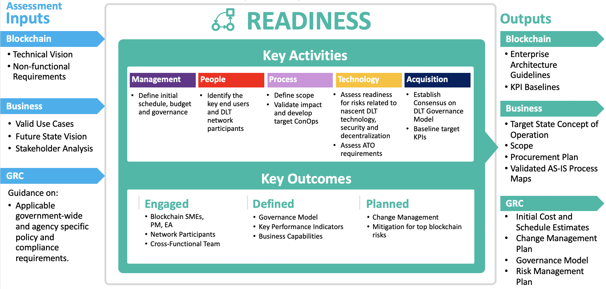

# Phase 2 - Organizational Readiness

The purpose of the Readiness Phase is to prepare enterprises and organizations for blockchain efforts and define key supporting activities to ensure organizational readiness. The structure and activities of the blockchain Readiness Phase are similar to other emerging technology readiness guidelines or strategy frameworks, such as M3. However, there are nuances specific to blockchain that should be understood and considered before an organization undertakes a blockchain initiative. The purpose of this section is to highlight these blockchain-specific nuances.

## Phase Inputs
The Readiness Phase leverages artifacts generated from the assessment phase. Figure 5 lists the inputs of this phase.

## Key Goals
The key goal of the Readiness Phase is to prepare enterprises and organizations for blockchain efforts by defining required organizational capabilities for success. This aims to increase the likelihood of success by providing guidance based on best practices and lessons learned to the following supporting activities:

 - A. Standing up a blockchain governance office.
 - B. Defining the scope of blockchain services and governance processes.
 - C. Assessing risks and establishing risk mitigation strategies.
 - D. Assessing existing systems’ integration readiness.
 - E. Assessing selected key performance indicators’ (KPI) evaluation readiness.

## Key Participants
To help ensure success, key participants must be identified and engaged throughout the blockchain Readiness Phase. They could include:
 - Product owners/managers who undertake overall management and governance of the Readiness Phase.
 - Blockchain subject matter experts who may or may not be from the agency initiating the program.
 - Subject matter experts from lines of business and systems with potential blockchain integration.
 - An enterprise architect who is well-versed with DLT to own the creation of the governance framework and capability definition exercises.
 - An information systems security officer/engineer or equivalent who ensures compliance and security of the proposed solution.

The participants may contain other stakeholders in part or whole of this phase. For example, end users could serve as the voice of the customer during requirements discovery and definition.

## Approach Guidance
In most cases, the Assessment Phase will precede the Readiness Phase to ensure use case selection and business relevance for the effort has been determined. Although rare, some government agencies may have assessment and readiness phases running in parallel. For example, this may occur when an agency has already completed a proof of concept and is planning for a larger project based on the proof of concept or integration with an external agency that has already implemented DLT.

_Figure 5: Readiness Phase (2) summary - [expand](../../assets/img/playbook/pb-phase-2.png){:target="_blank"}_

## Key Activities
Activities in this phase vary depending on the type and scope of selected use cases. Below is a notional activity guideline to prepare an organization for blockchain implementation:

  - A. Stand up blockchain Program Management Office (PMO) and governance office.
    1. Establish PMO processes.
    2. Establish Enterprise Architecture (EA) guidelines.
    3. Conduct procurement planning.
    4. Estimate initial cost for the selected business case.
    5. Create expected benefits chart.
 - B. Define the scope of blockchain services and processes.
    1. Analyze as-is view of people, processes and technology.
    2. Assess selected use case impact.
    3. Assess change management approach.
    4. Assess training needs.
 - C. Establish risk processes.
    1. Determine the components of the risk management processes.
    2. Conduct initial risk identification and mitigation planning.
    3. Prioritize risks based on criticality and area affected (e.g. data security, change management, etc.)
 - D. Assess existing systems’ integration readiness.
    1. Define as-is system context.
    2. Identify subject matter experts and points of contact for affected systems and interfaces.
    3. Define the system integration management plan.
 - E. Assess selected KPIs’ evaluation readiness.
    1. Reprioritize KPIs with the new understanding of risks and scope.
    2. Define baseline metrics for selected KPIs for the legacy processes and systems.
    3. Conduct new value discovery.

## Key Considerations
DLT is yet to be proven at production scale for public sector enterprises, which means best practices from production implementations are yet to emerge. However, the following are some key considerations that blockchain evangelists, chief information officers, and enterprise architects should consider as they conduct the Readiness Phase activities:

<table>
    <thead>
        <tr>
            <th scope="col">No.</th>
            <th scope="col">Key Consideration</th>
            <th scope="col">Description</th>
            <th scope="col">Analysis</th>
            <th scope="col">Takeaway</th>
        </tr>
    </thead>
    <tbody>
        
        <tr>
            <th scope="row">{{ kc.id }}</th>
            <td>{{ kc.key-consideration }}</td>
            <td>{{ kc.description }}</td>
            <td>{{ kc.analysis }}</td>
            <td>{{ kc.takeaway }}</td>
        </tr>
        
    </tbody>
</table>

## Key Outcomes
To ensure a government agency’s readiness for an emerging technology like blockchain, several internal and external factors have to be assessed, and in some cases, new areas need to be defined and established. The list below highlights definitions and high-level plans, which are further refined in subsequent phases and throughout the lifecycle of the initiative, resulting from the Readiness Phase:

 - Key network participants engaged with formal agreements.
 - Security strategy for participants defined and agreed upon by the different parties.
 - Onboarding/separation strategy defined for DLT participants.
 - In the case of a new consortium, responsibilities and governance model defined.
 - Mitigation plans in place for the following risk categories:
    - Technology
    - Business
    - Security
    - Performance
    - User experience o Governance
    - Adoption
    - Regulatory compliance o Enterprise Integration
 - Change management strategy defined for all the impacted parties.
 - KPIs defined and baselined for the selected business case.
 - Subject matter experts and points of contact from cross-functional teams and integrating systems are on boarded.
 - Procurement strategy defined.
 - Initial schedule and master plan defined.
 - Business capabilities defined.

The business case selected for implementation, external context of the implementation, and stakeholder and regulatory requirements may result in additions or modifications to this list.

## Phase Outputs
The following artifacts generated during the Readiness Phase support the Selection Phase and the phases following it. They should be leveraged to ensure the alignment to initial vision, continuous discovery, monitoring and mitigation of risks and continuous feedback to the stakeholders for forthcoming implementations:
 - Initial business capabilities
 - Scope of services overview
 - Target state CONOPS chart
 - Change management strategy
 - Program governance model
 - Prioritized risk management plan with mitigation plans for top risks
 - Initial cost and schedule estimates
 - Procurement plan
 - EA guidelines
 - KPI baselines and measurement guidelines
 - Validated as-is process maps

## Decision Gate
At the end of the Readiness Phase, the agency should be able to answer the following questions for the system (people, process and technology) and its governance:
 - Proposed system:
    - What are the key business capabilities of the proposed system?
    - Who are the key participants in the proposed blockchain initiative?
    - Who and what will be impacted? What are their roles?
    - What will be the impact?
    - How will the onboarding/separation happen?
 - Strategy and governance:
    - What is the proposed governance and management structure?
    - What are the key technological, business context, security, performance, user experience, program management and governance related risks specific to the proposed DLT solution?
    - How will key risks be managed?
    - Are KPIs defined and baselined?
    - Does the initial schedule and estimated cost allow for agile product development where the time and cost can be recalibrated based on ongoing learning?
    - What is the procurement strategy for the proposed program?
    - How will security be managed?
    - How will change be managed for the impacted people, processes and system?

At the end of a successful Readiness Phase, the stakeholders should have a joint understanding of the responses to the questions highlighted in the Decision Gate section.

[Next](/blockchain-playbook/phases/3/){: .usa-button  }