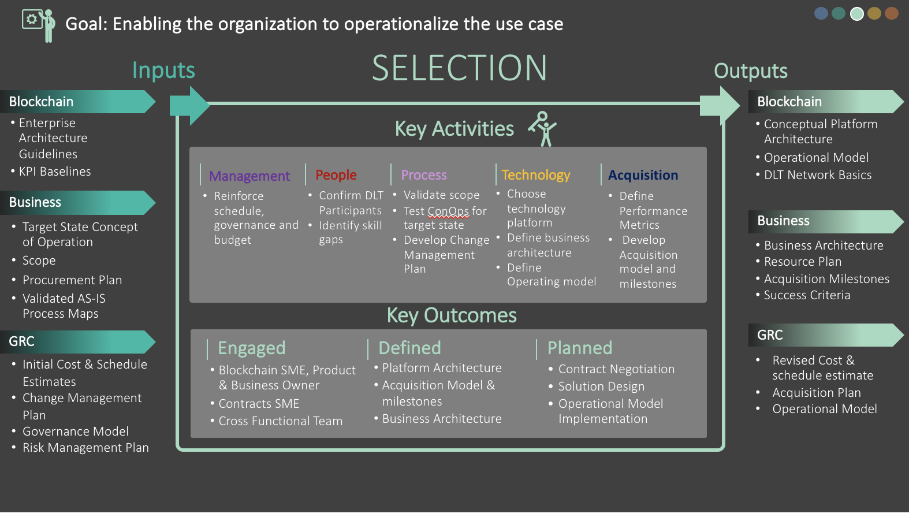

# Phase 3 - Technology Selection

Blockchain was first introduced as a type of DLT presented as the underlying platform of the Bitcoin cryptocurrency but has now evolved into a platform with much broader uses cases and various technical implementations. When it comes to selecting a blockchain solution for your agency, there are several factors to consider:

- **Business considerations –** Is it a fit for your agency? Consider who manages and controls the platform, whether you need a permissioned blockchain for security reasons, and the type of consensus mechanism used for adding transactions to the blockchain. Ask whether and how you will use smart contracts, in what languages you could code them, and how much involvement will be needed from your legal or acquisitions team. Pay close attention to operational requirements, such as response times and transaction costs, and determine where you plan to host the system and what it would cost. Als o unique to government – consider how to obtain the authority to operate and whether options exist within Federal Risk and Authorization Management Program (FedRAMP)-certified environments.
- **Technical requirements –** If it is a fit, which version best matches your requirements? Consider the degree of scalability and volume you need and whether this is best served by public or private infrastructure. This choice will also impact speed and latency, as well as security and immutability. If you will be supporting digital assets, then you must look at how assets are issued, funds are secured, and identity is managed, as well as blockchain specifications, notaries, network security modes, user authentication/authorization, and asset issuance and deployment. The question of open source versus proprietary platforms will be a key consideration, as well as deployment models.
- **How to buy –** Once you have identified your requirements and selected a suitable solution, it is still best to start small and aim for a minimally viable product (MVP). Focusing on the use case allows room for the ongoing evolution of the technology.

This section explores each of these factors in depth to guide you in the selection process.

## Phase Inputs
The Selection Phase expands upon the outputs from the Readiness Phase and starts delving into the various concepts and requirement categories that need to be considered and analyzed for successful selection and implementation of a blockchain solution.

_Figure 6: Selection Phase (3) summary_

## Business Considerations
The business problem and requirements must be clearly identified to ensure the appropriate blockchain platform is selected. Blockchain is a cross-cutting and transformative technology, but it is not the solution to every problem. Review and understand the description of the platform to ensure it matches the need. Look past the jargon to understand the specific differences noted below:
- Governance – Determine the nature of who controls and governs the software platform. For example, open source platforms, such as Ethereum and Hyperledger Fabric, are governed by their developer communities via nonprofit foundations, whereas Corda is managed by a corporate consortium called R3. The governance model could affect the support available.
- Mode of operation – Blockchain infrastructure can be operated as permissioned or permissionless. Government typically requires the permissioned mode for security reasons, but there could be use cases for connecting to the public permissionless chains, especially as techniques like zero knowledge proof protocols evolve.
- Transaction costs – Apps deployed on the Ethereum public blockchain incur transaction costs based on computational resources consumed. Private blockchain implementations do not have this requirement, but require their own supporting infrastructure, such as cloud servers.
- Consensus – Blockchains must reconcile transactions to maintain a single version of truth. At the time of writing this document, Ethereum uses a proof of work (PoW) algorithm (soon to switch to a hybrid proof of work/proof of stake algorithm called Casper). PoW ensures a high level of immutability and transparency. With the variety of consensus mechanisms available today, some algorithms may have more fine-grained approaches thatoffer better performance and privacy.
- Smart contract – The smart contract refers to the blockchain’s ability to store and automatically execute computer programs when specified conditions are met. Each solution supports a different setof programming languages, so consideration should be given to in- house programming expertise. For example, Hyperledger supports Java and offers a composer tool that allows organizations to develop smart contracts without writing much code, while Ethereum uses its own Solidity language. Corda also expands on smart contract by supporting the incorporation of legal prose along with the code.
- Currency – Although initial government use cases are likely to be focused on non-currency digital assets, such as contracts or land deeds, multiple forms of cryptocurrencies may need to be supported in the future. Support for this varies by blockchain. For example, Ethereum has Ether built-in. Ethereum and Hyperledger provide the ability to create other cryptocurrencies, and Corda provides little support for currency functionality overall.
- Chain data requirements – There are multiple ways that data can be stored on the blockchain, each with implications for security and performance. For example, you could store an entire contract package in a block or just a hash value of the location of those documents stored off that blockchain. One approach may be more secure, but the other could offer higher performance.
- Operational requirements – Does the current system satisfy the requirements? Is it a build within the private cloud or a buy (software as a service (SaaS))? Where are all the participating nodes going to reside, and do they trust each other? What interface requirements have to be met? What is the response time requirements for the blockchain? Other considerations include reliability and uptime in addition to the standard operational requirements for any software solution.
- Security requirements – A key factor in choosing any blockchain solution is to ensure its ability to obtain an authority to operate (ATO). A blockchain platform operating in an environment that is already FedRAMP authorized might be attractive as it makes getting an ATo much simpler. However, government must consider the potential of the peer nodes – the connection points to the blockchain – residing outside the standard system boundary.
- Operating cost – The costof operating and maintaining a blockchain solution is very difficult to estimate. There are no models to give a rough estimate and some unique factors, such as increasing storage requirements with the increase of blocks, increasing computational requirements for the participating / consensus node, and n o clear ‘ownership’ of the ledger. The agency should be aware of these factors and the reasons for a non-existent operating cost model when embarking on a blockchain project.
- Change management – Any blockchain solution comes with unique change management requirements due to the nature of the technology. Are changes to smart contracts allowed? If so, how does one manage that among all participating nodes? Changes to the asset structure in the block is not allowed. The agency should consider how these fit into their change management procedures, along with any changes to the procedures themselves.
- Private cloud versus SaaS (Build versus Buy) – The choice of deploying blockchain on a private cloud versus using blockchain as a service is governed by the following factors (refer Appendix D for more details.)
    - Sensitivity of the data – Data sensitivity and security is paramount for government. The blockchain vendor deploying their platform over a private cloud could provide private distributed cloud storage of data for maintaining data sensitivity. Another option would be an Ethereum- or Bitcoin-like data storage where anyone can get access to the data if the credentials are presented to the controlling node. Data sharing among entities would be controlled by the blockchain provider based on permission rules defined in smart contracts.
    - Deployment model – Implementation of consortium, semi-private or private blockchains requires a greater level of permissioned control over blockchain resources by providers. With blockchains deployed in their own private clouds, the blockchain providers can better control the resource configurations by implementing their own custom protocols, e.g. permissions, type of consensus protocol, size of Consensus Notary blocks, and number of blocks required to verify transactions etc.
    - System maintenance – Will you use your own DevOps resources and manage the service level agreement governance or leave that to the blockchain service provider?o Initial costs – Setting up an environment to test and research blockchain is not a trivial undertaking. A private cloud is more expensive upfront but allows the organization to better control the resource usage across users. A service offering is simpler, but less configurable.

## Technology Considerations
### Permissioned versus Public Permissionless Blockchain
A blockchain is a data structure that makes it possible to create a digital ledger of data and share it among a network of independent parties. There are mainly three different types of blockchains.
- Public blockchain networks
- Permissioned blockchain networks
- Private blockchain networks

All three types of blockchains use cryptography to allow each participanton any given network to manage the ledger in a secure way without the need for a central authority to enforce the rules. In addition to an introduction to the types of blockchains in the ACT-IAC Blockchain Primer, Appendix A provides further details about these blockchain networks.

### Determining Which Blockchain is Right For You
The following criteria should be considered while evaluating a blockchain for any project:
- Fitness for purpose – Consider and research to ensure the business requirements are within the scope of the mission of the product. For example, solutions like SkuChain or R3 Corda are purpose-built for financial transactions, while tools like Linux Foundation’s Hyperledger Fabric or Microsoft’s CoC o are generic solutions, allowing you to build purpose fit products to meet your requirements.
- Operational considerations
    - Blockchain scalability and volume – The scalability of a particular blockchain network type determines the maximum transaction throughput (number of transactions processed per second) and, as your blockchain grows, the maximum volume of transactions that can be processed within reasonable performance criteria. Adequately develop the lifecycle requirements to ensure the solution being considered meets the scalability the agency needs over time.
    - Performance of the blockchain, especially speed and latency (review benchmarks) – Blockchain speed is the transaction throughput (maximum number of TPS), which is determined by the block size and the consensus delay. It is dependenton the combination of the processing power of the network in which the algorithm is placed, how large the block is, and the particular type of encryption protocol. Performance is not determined by whether a blockchain is public or private.
    - Security and immutability – The documented level of confidence of security within the blockchain is high. The blockchain itself is inherently resistant to threats while the off-chain applications (e.g. smart contracts, distributed apps, and microservices) are not.
    - Storage and structural needs – Since every node in the network maintains a copy of the chain, every node needs to have enough storage. Hence care should be given to reduce the size of each block.
- Resource requirements (Appendix E) – The choice of blockchain infrastructure will impact the type of resources needed both internally and with the implementation team. For example, if Ethereum is chosen, there is a need for Solidity developers. Architects wh o understand blockchain operations and their interactions are also needed.
- Off-chain data management – Due to security and speed considerations, the operator of a blockchain may choose to store the bulk of the data off the chain, with a pointer to it stored on the chain. Itoperations should consider the procedures and infrastructure needed to manage this data as well.

There may be exceptions depending on the project, and it is possible to use a different type of blockchain to reach a particular project’s goal. Please refer to Appendix F for further explanation of the technical criteria.

### Digital Assets and DLT Requirements
A digital asset is a floating claim of a certain service or good(s). It is ensured by the asset issuer, which is not linked to a particular account, and it is governed using computer technologies and the internet – including asset issuance claim of ownership, and transfer. Blockchain-based DLT provides an alternative to centralized digital asset management system by providing:
- Distributed transaction processing – Transactions are processed in a decentralized manner by geographically distributed nodes of the network. Moreover, defining the rules for transaction processing (e.g., defining what valid transactions are) could be split from the processing.
- Asset issuance – In the most general case, this could be performed by any user of the network.
- Security of a user’s funds – This could be performed by third parties using custodial or non- custodial wallets.
- Identities of services (and optionally customers) – This could be established by building Public Key Infrastructure (PKI) based on a blockchain.
- Application development – This does not require cooperation with blockchain maintainers.

### Specific Considerations of a Blockchain Supporting Digital Asset Management
There are some additional considerations for using blockchain technology to support digital asset management (additional details are in Appendix F):
- Blockchain specification
    - Transaction logic – What are valid transactions with regard to the present system state (e.g. the rules regarding how transactions transform the system state, etc.)
    - Immutability logic – What transactions constitute a block and how are the block headers secured.
    - Consensus logic – How nodes agree upon the state of the system; how blockchain forks are resolved, etc.
    - Network logic – How transactions, blocks and other data are transmitted among network nodes, etc.
- Blockchain notaries
- Blockchain network
- User authentication and authorization
- Asset issuance
- Deployment models

### Deployment Models
There are various deployment models for blockchains in the market. Government should consider which model suits them the best. Listed below are the common models. Please refer to Appendix B for details.
- Separate Blockchains for Assets: Each digital assetor a setof assets maintained by the same issuer could potentially have its own blockchain, either permissionless or permissioned.
- Colored Coin Protocols: Colored coin protocols share the user authentication model with the underlying blockchain. Some examples include Chromaway, metacoins and Open Assets.
- Multi-Asset Blockchains: Multiple assets can be natively supported by a blockchain. Multi-asset blockchains have more space-efficient proofs of ownership, as simplified payment verification could be utilized for all natively supported blockchain assets.
- Smart Contracts: User-defined assets could be represented with the help of a smart contracton a smart contract blockchain.

### Open Source Versus Proprietary Blockchain Platforms
Differentopen source blockchain platforms are suitable options in implementing different consensus protocol mechanism, blockchain network types or specific use cases. They are a good option when implementing blockchains with more censorship resistant use cases. The use of open source blockchains would reduce the investment cost in building blockchain services. However, organizations may need to manage the security, scalability and throughput considerations in their own custom ways. Interoperability and ease of integration are areas of consideration, as open source blockchain platforms do not traditionally do well in these areas. (Details for open source/proprietary models are in Appendix C.) Blockchain as a Service (BaaS) (details in Appendix D) is an emerging model that combines the benefits of an open source platform with the benefits of proprietary solutions.

### How to Buy – Reference to GSA Atlas
While the procurement methods and vehicles vary, GSA’s FastLane process improvement contract serves as a good example of how an agency should procure a blockchain solution.

#### Leverage commercial contracting methods
Leverage the efficiency of commercial contracting methods. Blockchain was created by the commercial industry, so government should buy it as a commercial item and use commercial buying methods. Similar to how private companies structure blockchain development buys, the procurement process should require vendors show, or demonstrate, how they build blockchain products, not merely tell about process via a long proposal. In addition, industry doesn’t use cost- type contracts for blockchain and neither should government.

#### Buy small, build small, test, and iterate
Set up each contract for a quick win, then determine how to scale that success or pivot quickly. Well-intentioned agencies frequently default to creating large scale software development contracts. However, these procurements often take years. In addition, larger contracts often lead to more bureaucracy, slowing down the delivery of a working blockchain. Instead, adopt modular contracting methods. First award a smaller contract for the developmentof a blockchain MVP. The time to award will be faster, the procurement risk lower, and within 12 months of award, the agency will likely show a quick win with a deployed working product. Working products also convince others about the utility of the technology and, therefore, play a role in the agency's comfort and adoption of blockchain. Once the MVP is developed, the agency can pivotor procure additional services to further develop features for the blockchain product.

#### Do not lock technical requirements into the contract
To ensure the use of new, more effective technologies and methods is not blocked, do not lock technical requirements into the contract. Overly prescriptive requirements significantly limit a vendor’s flexibility to propose innovative approaches to blockchain. They also wrongly assume that the features described in the original requirements document are equally valuable and the users’ needs will not change over time. This significantly limits the ability to leverage valuable blockchain product features that are not yet developed. Instead, use a Statementof Objectives to scope the requirement around the use case or product vision. The government will still control the technical requirements in the form of user stories, which will be crafted during the life of the contract and will be prioritized and selected by the productowner before each iteration cycle. The contract will provide the flexibility to build any features within the broader use case or product vision. In addition, this approach allows technological enhancements to never end.

#### Pay for results, not time
Buy blockchain design and development services as a repeated process for the delivery of a working product. When technical requirements are not locked into the contract and the government and the vendor together formalize the definition of “done,” then one of the most advantageous pricing formats is firm-fixed price per iteration. When the vendor completes the user stories at the end of the sprint, and the definition of done is met, the vendor gets paid and the government receives working code that is ready to be deployed.

## Phase Outputs
After analyzing the various factors that have to be considered in choosing a blockchain platform, a detailed platform model starts to evolve, which then drives a detailed schedule, cost, resource and task estimate. The corresponding acquisition model, along with the operational framework, start to take shape.

## Decision Gate
At the end of Selection Phase, the following use case questions should be answerable:
- What type of blockchain technology should be used? Is it private or permissioned or public?
- The blockchain mechanism to be used to maintain ‘world state’ (PoW, proof of stake, smart contract, etc.)
- A Governance Model
    - Who owns the asset?
    - Who can initiate requests to add to the chain?
    - Which organization governs the smart contract?
    - How are changes to the Smart Contract negotiated?
- What is the asset data structure, and corresponding off-chain requirements?
- A decision on the deployment model – private or SaaS model.
- What are the components of an implementation and operating cost model?
- Will the solution use open source or proprietary blockchain technology?
- What are the resource requirements for the development and operations of the solution?
- A procurement approach and model, with all the necessary approvals.

The following factors will determine your moving to the next phase:
- If your development and operating cost exceed your funding level, stop at this phase.
- If you don’t have a contract vehicle, stop at this phase.
- If your resources are not up to speed with the technology, stop at this phase.