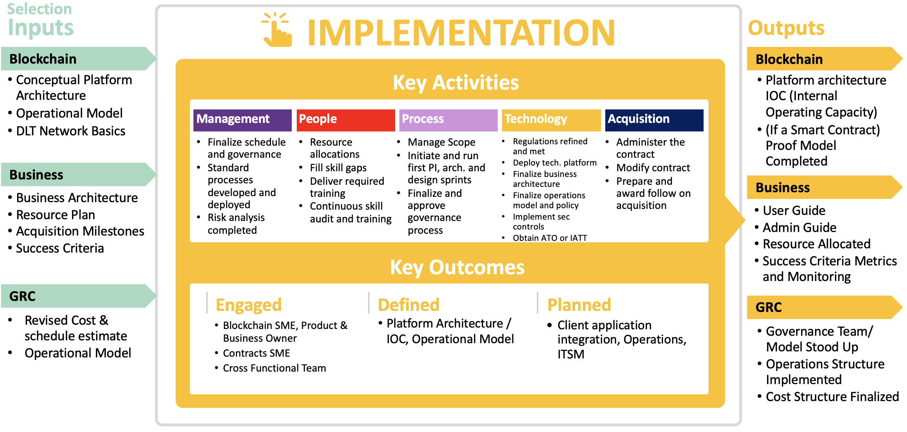

# Phase 4 - Implementation

This phase ensures that the inner workings of the solution are completed and tested. It closely examines the technical implementation of the components of the blockchain network, as well as the operational aspects, such as governance and security posture, to ensure the optimal operations of the blockchain solution. Key activities and outcomes for management, technology, people, process, and acquisition are also examined.

If you were manufacturing a cell phone instead of deploying a blockchain solution, you would expect that at the end of the Implementation Phase, the subcomponents of the phone were complete and tested before moving to the Integration Phase of incorporating a particular carrier’s service, other applications, accessories, etc. The concept is the same here.

The term “Authority to Operate (ATO)” defines the criteria for success for the blockchain solution: the system should perform and operate according to the specified (functional and technical) requirements set forth by the product owner and the other stakeholders, and the solution’s inner workings should be tight and secure.

_Figure 1: implementation phase (4) summary - [expand](../../assets/img/playbook/pb-phase-4.png){:target="_blank"}_

## Phase Inputs

To proceed with implementation, the blockchain must leverage the outputs from the Selection Phase. The solution needs to have an established Conceptual Platform Architecture, Operational Model, and DLT Network Basics. The business must have a Business Architecture, Resource Plan, and defined Acquisitions Milestones and Success Criteria. The Governance, Risk and Compliance (GRC) area must have a revised Cost and Schedule Estimate, Acquisition Plan, and Operational Model.

## Key Goals

The key goal of the blockchain implementation phase is to take the models, processes,
technologies determined in the previous phases and implement them so they can be integrated
within the organization(s) in the next phase like smart contracts, blockchain network,
blockchain service, governance, workforce, and metrics.

## Key Considerations

Now that the blockchain framework and the protocol you will be implementing is known, it is
time to consider some additional factors that have the potential to affect your success:

- The choice of the platform. In the Implementation Phase, the choice you have made in previous phases leads to a series of additional considerations related to programing and architecture.
  - For example, in an Ethereum-based platform, you will most likely program in a language called Solidity and need to choose an integrated development environment for developing applications in your ecosystem.
  - Another example is in a Hyperledger-based platform, you will need to finalize the appropriate number of separate orderers (whose sole responsibility is to ensure the order of creation of blocks) to make certain there are no centralized points negating the benefits of a decentralized system.
- The consensus model, such as Proof of Work or Proof of Authority. This choice was finalized during the Selection Phase, and it affects how governance is approached. During the Implementation Phase, you will need to finalize and implement the related governance rules. Ensure it is implemented as intended as poor implementation may lead to incomplete transaction processing and data integrity issues.
- Participants and their roles. Refinement is needed regarding the identity, credential, and access management decisions made during the Selection Phase. How are participants identified? Are there group accounts? How many and who participates in the consensus mechanism? Do the consensus participants change over time? If changes occur, how might each change impact the governance rules set in place? Who has access to what data? How is physical access addressed? How are personnel changes addressed?
- Operators of the system at different levels. How will end users leverage the functions provided? How will developers use functions included for them? During the Readiness Phase, you defined the skillsets and training needed to implement and maintain blockchain initiatives. Now it is time to write guides, launch supporting resources, and train. It is also time to translate insights from the stakeholder analysis performed in the Assessment Phase and the user experience guidelines you developed during the Readiness Phase into the user interface designs for items such as auditing and display of
the blockchain data.
- Onboarding and offboarding. During the Readiness Phase, you crafted an initial onboarding/separation strategy. After making your technology selections, the strategy should be refined. For example, in a permissioned network, careful thought has to be given to the verification of an organization that wants to participate. Additionally, you must ensure a new entrant does not lead to security vulnerabilities. Examples of security issues include 51% vulnerability on a public blockchain and on a private network, a similarly unfavorable shift or incompatibility with the consensus rules.
- Asset creation and storage. During the Selection Phase, you gave careful consideration to on-chain versus off-chain data (asset) creation, as well as its implication on performance, storage, and security. You also selected a deployment model. Now it is time to implement, ensuring the ability to scale and potentially archive as those assets go through their lifecycles.

Additional considerations and refinement are necessary to take your blockchain solution from the plans and strategies developed in earlier phases to launching and maintaining during the Implementation Phase. It is time to ensure the technical and functional plans of a comprehensive solution.

During the Implementation Phase, be sure not to lose sight of the primary goal. You must ensure the solution solves the business problem discussed in the Assessment Section of this Playbook.

## Key Activities

Implementation of an enterprise blockchain platform typically involves:

- The overarching project management plans, which drive the deployment and maintenance of a system, including standard operating procedures and continuous risk management plans. These plans are finalized and begin execution during this phase.
- The stakeholders who will be procuring, providing, operating, and interfacing with the blockchain solution. They engage with the blockchain PMO, receive any necessary training, and begin working in the ecosystem.
- The requirements to be met through implementation. Finalize the list of, priority order for, and iterations in which functional requirements will be developed. Refine the list of operational requirements and governance rules necessary for deployment and maintenance of a system with regard to lifecycle and use case events.
- The physical components of the ecosystem, which include shared systems, infrastructure, and applications that manage the blockchain and its functions, as well as interact with and affect the data of the blockchain. Update and finalize the architectural blueprint and design.
- The blockchain data and transactions, including information stored within the blockchain ecosystem and the data elements/transactions for which network members have varying authorities. Refine and finalize the logic, security, and other considerations regarding data creation, management, validation, encryption, any archiving, and
destruction.

### Management

**Finalize Schedule and Governance**
Ensure that you are managing scope, time, cost, quality, human resources, and risk across the
blockchain project. Refine business cases for technology investment, working with enterprise
architecture and information security professionals necessary over the solution’s lifecycle.
Work closely with blockchain technical leads, developers, and testers. Manage any outstanding
legal and regulatory compliance issues if associated with digital tokens. Refine the plans for
challenges in implementing and integrating blockchain technology solutions, such as testing
interoperability of blockchain applications with legacy solutions and data integration
challenges. Continue to refine and implement the change management approach developed
during the Readiness Phase to address the business paradigm shift made possible through the
implementation of blockchain technology.

**Standard Processes Developed and Deployed**
Standards in policy and processes will be derived from the finalized governance model and
integrated technical strategy (both referenced in this playbook). Disciplined operations teams
manage enterprise-wide appliances, which govern blockchain appliances, through a rigorous
configuration management practice.

**Risk Analysis Completed**
To achieve the goal of ATO, the risk management team:

- Finalizes its selections for the appropriate security controls.
- Implements the selected security controls.
- Assesses the implementation of the controls to ensure they are operating as intended and producing the desired outcomes.
- Evaluates whether the blockchain fabric is hardened as required.
- Documents actions to ensure continued security and low risk.

During the Implementation Phase, the team monitors and audits the blockchain technology and identifies any weaknesses in its security posture. This includes examination and determination of the likelihood and magnitude of harm from unauthorized access, use, disclosure, disruption, modification, or destruction of the blockchain, ecosystem components, and the data processed, stored, or transmitted. The team then updates its plan of actions and milestones for mitigation and audit defense activities.

Be sure to factor in Federal Information Processing Standard (FIPS) Publication 199, “Standards for Security Categorization of Federal Information and Information Systems,” using the blockchain as a complement to integrity checks to determine how prepared and where the department/agency information system security officer stands.

Additional specific activities incorporated into a rigorous risk management practice, as it relatesto the implementation and integration of any blockchain fabric, are discussed throughout this chapter.

### People

The implementation of blockchain into the agency/department will be a service and platform procured by the acquisition team. Key to the government being able to implement a blockchain solution is equipping program and project managers with the knowledge, skills, and abilities to manage a technical workforce which includes contractor personnel. The government has recognized the need for this type of blended digital workforce (digital IT acquisition professional)6 , and the Federal Acquisition Institute is working to deliver the training and certification.

It is also critical to have a Contract Officer Representative (COR) capable of understanding and managing the contract terms and conditions as part of the lifecycle sustainment of the procurement approach and model developed during the Selection Phase.

The key participants identified and engaged since the Assessment Phase must continue to be involved. This includes blockchain network members, representative(s) of the line(s) of business, the application portfolio, and supporting IT organizations. Depending on the attributes of the deployed fabric, enterprise governance will transform in support of the new service. Continued engagement of stakeholders impacted by the implementation and integration of the new blockchain service can provide critical feedback and buy-in for continual service improvement.

Additional key participants include:

- Blockchain Subject Matter Expert has the knowledge and expertise needed to help develop the necessary smart contracts and blockchain network infrastructure, as well as to customize and configure the blockchain service.
- Product and Business Owner need to be iteratively involved to ensure the implementation developed by the blockchain subject matter expert satisfies the requirements.
- (Smart) Contracts Subject Matter Expert is need if the blockchain solution involves smart contracts. This expert will help with the programming of the smart contract, as well as testing and evaluating the logic to uncover potential vulnerabilities. To do this, software development best practices are employed and game theory is used to test the logic and
corner cases of the contract.
- Cross-Functional Teams make connections among the domain-specific knowledge, the blockchain knowledge, and other technical knowledge. This helps the blockchain subject matter experts with the development of the blockchain solution by bringing together the domain logic for the smart contracts development, the organizational infrastructure knowledge for the implementation of the blockchain network, and the application knowledge for future integration of enterprise application.
- Product and Business Owners are also need to be iteratively involved to ensure the implementation developed by the blockchain subject matter expert satisfies the requirements. 

**Resource Allocations**
The resource allocation plan for talent management will be updated, finalized, and implemented. It should pave the way for addressing the skill gap, and it should consider how to best leverage existing resources to successfully implement the blockchain solution.

**Fill Skill Gaps**
Execute the resource allocation plan to address any outstanding skill gaps according the audit results. Stakeholders will either be trained or complemented with internal and/or external subject matter experts and/or tools that will be added for the duration of the Implementation Phase iterations.

**Deliver Required Training**
Training will need to be specific to the domain expertise of the resource and according to the skill gap. For instance, acquisition specialists would not need a developer course in Ethereum, but they might need a business understanding of blockchains, token-based economy, smart contracts, and the use of gas if public Ethereum is used for the blockchain solution. Furthermore, the Office of Federal Procurement Policy (OFPP) launched a new specialization for federal contracting professionals to increase expertise in digital services. The Federal
Acquisition Certification in Contracting (FAC-C) Core-plus specialization in Digital Services (FACC-DS) builds on the digital IT acquisition professional (DITAP) program and focuses on learning to design innovative and flexible procurements for services such as human-centered design, iterative development methods, cloud, and X-as-a-service.7

**Continuous Skills Audit and Training**
During the Readiness Phase, you defined the skillsets and training needed to implement and maintain blockchain initiatives. In the Implementation Phase, you should monitor and refine the training audit. Any additional surveys and/or evaluation of the current workforce will take place to determine whether the stakeholders have the appropriate skills.

Continuous learning is required to maintain the ecosystem throughout its lifecycle and should be included in the talent management and resource allocation plans being executed during the Implementation Phase. As blockchain evolves, new best practices and lessons learned, as well as updated software, configurations, etc., will result in the need for the effecting workforce to adapt how they are implementing the blockchain ecosystem.

For example, security practitioners should receive incident response training for the blockchain ecosystem upon ATO. But they should also maintain ongoing contact with blockchain security groups, professional associations, academia, and any relevant open source communities to ensure they are current and trained with regard to evolving security practices, techniques, and technologies, as well as to ensure they have awareness of the latest threat and incident information and other relevant updates. 

### Process

**Manage Scope**
During the Implementation Phase, you should ensure the project’s scope is accurately defined and mapped to a work breakdown structure with sufficient resources allocated. Continued collaboration with stakeholders during the Assessment, Readiness, and Selection phases should have resulted in the identification and refinement of use case ideas, value propositions, risks, and costs. These previous phases produced the blockchain-enabled solution’s continuity of operations plan and a validated analysis of alternatives, which translated to several high-level
scope decisions.

In the Implementation Phase, it is necessary to clearly refine and finalize what requirements are in scope and what requirements are out of scope without any ambiguity. Any scope creep should be diligently addressed. Best practices dictate the implementation team should finalize the documented project goals, business objectives to accomplish, success criteria, deliverables, epics, features, user stories, evaluation criteria, tasks, milestones/timelines, assumptions, dependencies, and resource needs. There are specific categories of work scope where the team will need to validate/revalidate assumptions, make decisions, and lock the scope of work with user stories and acceptance criteria in the context of the following:

- Business processes that are being covered.
- End users/blockchain participants and their roles and responsibilities.
- Permissioned versus permissionless network.
- Identity, credential, and access management.
- Consensus mechanism.
- Nature of data, digital assets, and transactions.
- Form factor of nodes.
- User interface/user experience.
- Smart contracts.
- Interfaces to oracles and partner references.
- Third-party intermediaries.
- On-chain versus off-chain information restrictions.
- Security controls.
- Scalability, performance, auditability, and security requirements.

**Initiate and Run Series of PI, Architecture, and Design Sprints**
Implementation of an end-to-end blockchain solution involves engineering both the infrastructure solution and the application solution that runs on top of the infrastructure solution.

The infrastructure solution involves heavy investments and it cannot easily be changed. When you considered design in the Readiness Phase, you should have refined your architectural blueprint with modular, reusable, and extendible options whenever possible. Given the rapid transformation in the blockchain technology space, what works today may become a significant burden or even obsolete in 3-5 years. In that sense, rapid prototyping with constant iterations is the preferred way of implementing blockchain solutions.

During the Implementation Phase, you should use a systems engineering approach to further refine the detailed design and architecture of the blockchain solution. This may involve evaluating and making or refining decisions regarding at least some of the following:

- Choice of the development platform, technology stack, tools ecosystem.
- Commercial of the shelf versus in-house.
- Open Source versus proprietary solution.
- Cloud, on-premises, or a hybrid deployment architecture.
- As-a-Service solution.
- Network architecture and network registries.
- Business process flows.
- Consensus algorithms.
- Design of blocks, distributed ledger databases, data.
- Design of transactions.
- Design of smart contracts.
- User interface/user experience design.
- Leverage machine learning, artificial intelligence.
- Interoperability with legacy and third-party systems/data.
- Privacy.
- Rules and policy engine.
- Cross-blockchain architecture and interoperability.
- Non-functional requirements.

As described in the Assessment and Readiness phases, the use of Agile and DevOps methodologies are highly recommended for the project management approach. Included in that is the management of the scope for your blockchain solution implementation. 

Agile development provides an iterative roadmap where implementation is done in small increments. Achieving incremental gains satisfies stakeholders while enabling you to strategically scale so that you can optimally address pain points, while tackling one priority area at a time, to ultimately accomplish transformational objectives and advance mission goals. This method of continuous integration/continuous delivery begins with building a minimum viable product within a pre-determined timeframe, as referenced in the Assessment Phase.

This Minimal Viable Product MVP should be established during an initial program increment (Increment 0) of 8-12 weeks when the team will finalize the development of the architecture and design of the blockchain solution components. During this time, you should identify the overarching epics and a starter list of product backlog items. These backlog items should include features and architectural enablers. Prioritize the backlog items into ‘must have,’ ‘need to have,’ and ‘nice to have.’

Next, finalize the schedule for the subsequent program increments and divide the work into sprint iterations. Refine the product backlog frequently to ensure the implementation team gets a clear understanding of the work to be accomplished. As the team completes and deploys increments, ensure continuous stakeholder involvement and team response.

**Finalize and Approve Governance Process**
As organizations embark on blockchain implementations, it is imperative to take all the network participants along for the journey. In the Assessment Phase, you performed stakeholder analysis to baseline and create a management plan for their level of participation and project support, which you have been executing since.

During the Implementation Phase, it is critical to capture the measurements against your goals for stakeholders. The shift from central ownership of systems to shared ownership takes hold at a new level during this phase. Network partners are now on shared infrastructure actively exchanging information, data, and/or resources. To ensure your project’s success and achieve the goals of your stakeholder management plan, make any necessary adjustments to how you are communicating with and engaging stakeholders.

To refine and finalize the governance model and process, you should take into account the changes to the blockchain network affecting each participant's enclave. Also include rules and expectations for each participant to ensure any changes to their enclave do not impair the blockchain implementation.

Security incidents, including information spills that used to just affect one organization, may now impact everyone on the shared infrastructure. Much like before, security practitioners should be continuously monitoring, patching, and security testing—including penetration testing, vulnerability scanning and policy reviews—the systems and applications used by all members. But inside a blockchain network, the results of these efforts should be recorded and published to the other members of the network. Security incidents that occur anywhere in the ecosystem must result in notification and shared documentation and recording of effective investigation, detection and analysis, as well as coordinated action and mitigation regarding containment, eradication, and recovery.

Security is just one area that may have significant impacts to a blockchain implementation. The following areas need to be clearly understood and governance policies must be refined/defined and approved during the Implementation Phase. Further, the change management plan and associated processes might also be updated to address changes in the context of the following:

- Security procedures and approvals.
- Operational and legal risks.
- Governance model/roadmap including the consortium model.
  - Dispute resolution.
- Regulatory compliance.
- Intellectual property.
- Privacy versus transparency.
- Decentralized autonomy.
- Legal enforceability of smart contracts.
- Standards.
- Paradigm shifts.
- Decentralized trust.
- Data sharing.
- Maintenance responsibilities in a decentralized system.
- Accountability and responsibility.
- Onboarding/offboarding procedures.

With the shift to this new decentralized business paradigm in mind and areas examined to update the change management plan, it is now time to refine and finalize the choices associated with the governance model and then implement all the processes and procedures required for operation of the blockchain solution. (A more detailed definition of governance and its components is discussed in Appendix I.)

There are differences between public permissionless versus permissioned blockchain that you should consider regarding governance. The following focus areas exist only for permissioned or can be ‘self-regulated’ for public permissionless:

- Onboarding / offboarding procedures (non-existent in public).
- Operating cost (non-existent in public).
- Change control mechanism (self-regulating for public).

### Technology

**Regulations Refined and Met**
Blockchain networks are fundamentally different from current technology solutions. Participation includes decentralization and autonomy along with distributed nodes that are not physically or logically in same computing environments.

For ATO of intra-agency and interagency blockchain networks, the blockchain PMO must ensure adherence to and use of FISMA and the Federal Information Security Modernization Act 2014.

In general, you will be required to comply with federal security regulations and guidance covering system architecture best practices, operational processes, infrastructure, reporting, network architecture, configuration management, controls, and continuous monitoring over the entire lifecycle of the technology. However, in case of an agency joining a public permissionless blockchain network, this compliance becomes difficult, as no official governance model exists.

NIST Special publications 800-53 defines access controls, network controls, security controls, risk management, recovery, continuous monitoring, and contingency planning. These security standards cover on-premises datacenters, public cloud, or GovCloud implementations. 

In the case of Department of Defense (DoD) systems that include DoD network participants, you must also adhere to DoDI 8500.01, “Cybersecurity,” DoDD 8000.01, “Management of the Department of Defense Information Enterprise (DoD IE),” and DoDI 8510.01 and NIST Special Publication 800-37 Rev. 2 regarding the Risk Management Framework (some tailoring is necessary for blockchain). Additional DoD-relevant policies can be found in the Information Assurance Support Environment. The Defense Security Service (DSS) Assessment and Authorization Process Manual (DAAPM) guide is largely applicable, and you may find it extremely helpful in developing your compliant path to ATO. NIST has also released a draft of Special Publication 800-204, Security Strategies for Microservices based Application Systems, as of March 2019.

Additionally, in nearly all cases, open source software (OSS) is considered commercial software, so the policies regarding commercial software continue to apply to OSS. For DoD, reference DoD CIO memorandum "Clarifying Guidance Regarding Open Source Software (OSS)”.

**Finalize Business and Solutions Architecture**
There are many design options for your network governance model to ensure it meets the business needs of your members. One popular solution has a single agency take the responsibility of provisioning and managing a complete permissioned blockchain network. Each participant can then request a node and manage their own smart contracts. The participants share the operational costs of the blockchain network.

In another variation, each participant provisions their own nodes, which join a larger blockchain network where the operational cost is funded through the act of transacting. This governance process requires that blockchain participants agree on a voting process and processes about joining or withdrawing from blockchain network.

You should leverage a permissioned blockchain network when the participants have a greater degree of trust, these networks need less computational and network resources to run. Unless these networks have sufficient nodes, these blockchain networks may lack the resilience resulting from distributed and redundant nodes.

A permissionless blockchain network has lower overall management cost, but has a high individual operational cost resulting from each participant provisioning one or many nodes. There are no security governance models in a permissionless public network. Each participant is responsible for securing and managing their node(s). The management costs associated with adding new participant cost is lower.

When looking to solution architecture (infrastructure) and application design, emphasis must be placed on node architecture. This is because the underlying governance framework drives many of the functional requirements for nodes, which can vary greatly.

For example, in one blockchain instance, nodes may be responsible for validating transactions and storing the transactions to the ledger. There might be a mix of light nodes that only make requests and full nodes that validate, store, and act as miners constantly looking for a new block. This computationally intensive activity of full nodes and the decreased capability requirements for light nodes affects the overall development of the node architecture and physical architecture, which are designed specifically to be able to address the functional requirements of the two types of nodes.

Another solution framework uses a different approach to synchronize all ledgers and analyze the validity of transaction. Unlike the case where all nodes replicate the validation activity, only endorsing nodes within a specific channel need to validate the transaction. The rest only read and write blocks once the orderer has satisfied itself with the number of responses that are needed for the quorum. Each node verifies the authenticity of data before committing to the ledger. This significantly reduces the network traffic generated from validating the transaction and also limits traffic to only when a transaction needs to be committed to the ledger. Thus, a node needs lower computational power and network bandwidth.

Blockchain infrastructure should be inherently highly available, a downed node does not impact the transaction process, unless the network does not have enough endorsing nodes on each channel to meet the smart contract’s quorum requirements. Once a previously unavailable node becomes available, the blockchain framework under the cover updates the node’s distributed ledgers with other nodes. Nodes in a Distributed Ledger Framework are responsible for off-chain data storage and hosting client application. Both these functionalities require a well-designed architecture. The processing order of transactions is important and cannot be modified. This requirement constraints the node architecture’s ability to scale horizontally as performance degrades or transactions are queued waiting to validated and written to the ledger.

When considering multi-platform interoperability, blockchain framework implementations and internode communication protocols are substantially different. There are few projects that are trying to create an overarching protocol that hide the underlying blockchain communication protocols. These projects are in infancy stage and are not expected to be available soon. As this is area grows, more insight into this area will be discussed.

There are on-chain versus off-chain considerations throughout the process. Supporting documents to ledger transactions can be large and, for performance and space reasons, these documents are kept off-chain with a hash stored in the on-chain block. Though this is a trivial technical issue, it has major implications to the validity of the business contract, data governance, auditing, and security. The rules around archiving, life term of data, have yet to be worked out. However, the off-chain data is as important as ledger data, and from an infrastructure, governance, and security point of view, need to be handled with same diligence.

**Deploy Technology Platform**
By building out the governance model and associated policies, you have enabled the automation of many operational functions of the blockchain network once it is deployed.

You should ensure mechanisms are in place for continuous monitoring, analysis, and patching, including for any applicable archived components/data. Among other tactics, this should include vulnerability scanning for patch levels; functions, ports, protocols, and services that should not be accessible to users or devices; improperly configured or incorrectly operating information flow control mechanisms. It should:

- Determine what information about the blockchain ecosystem is discoverable by adversaries (to take corrective action).
- Document results to compare over time.
- Review audit logs to see if any detected vulnerabilities have been exploited and if there are any multi-vulnerability/multi-hop attack vectors.

While the distributed nature of blockchain reduces the complexity associated with disaster recovery and data backups, you should regularly review, test, and refine the contingency plans developed in the Readiness Phase. This should include plans for system failures, disruptions, and compromises.

Ledgers and off-chain data can quickly grow for large networks. Large ledgers require large bandwidth and time to synchronize within nodes. The operations team need good continuous monitoring and alerting framework to detect problems or potential issues well in time. A majority node failure within a small blockchain network is a security concern due to potential lack of quorum or a hijack by a small set of rogue voting nodes.

Additionally, in blockchain, a Denial of Service attack involves submitting more transactions to the blockchain than it can handle. Since many blockchains have fixed size blocks created at a fixed rate and are stored in a distributed fashion, they have a maximum capacity that a determined attacker can exceed, rendering the blockchain unusable. 

You should test for alternate storage and processing, recovery, and reconstitution procedures, and more for system-level, node-level, and any external systems that interact with the blockchain.

Also use your detailed documentation of the design for the business functions of the blockchain to do functional testing. This includes creating a transaction, approving a transaction, looking up data, etc. Include security activities and component interactions such as authentication, validating authority to approve transactions, encryption and decryption, and API security. Ensure unauthorized activities across the ecosystem result the prevention of execution, as well as any other desired actions/notifications.

Finalize Operations Model and Policy
Blockchain frameworks are still in evolving with emerging standards slowly showing up in the marketplace. There are frequent announcements of new blockchain frameworks from academia, as well as commercial entities. There will likely be changes to blockchain frameworks and possibly major consolidation in next few years. A new framework(s) may replace current leaders. Your selection of blockchain network and its operating model may affect your implementation. There are three types of operational models:

- **White Label Operating Model** – This popular consumer model allows private brands to off-load all manufacturing logistics and focuses exclusively on design and marketing. This model is equally appropriate for consortiums, enterprises, and exchanges to jumpstart offerings of blockchain-based services. This approach is vulnerable when the supporting vendor is unprepared and not forward thinking. The vendor may downplay future deprecation of underlying blockchain framework, security vulnerabilities, and continuing to use an older unsupported framework that has been supplanted by a faster  and well-supported framework. This model allows the blockchain owner to mitigate risk by transferring the ledger to another vendor. Transferring the ledger is not a simple activity; it will take time and planning.

- **Founder Manager Model** – This model leverages both name recognition and new frameworks quickly. It brings an impartial structure to facilitate collaboration between members of the blockchain platform. The founder has a personal stake in quickly resolving disputes and making the platform succeed. But there are other traits of founder-centric models that may jeopardize success. These usually are issues around weak internal processes, weak security controls, too many ad-hoc decisions, and overconfidence in their own immortality.

- **Third-Party Managed Model** – This is similar to the white label model with a few key differences. There is a need for strong in-house blockchain expertise to enforce management structure and planning. The vendor managing the platform is more focused on day-to-day operations, security, and performance optimization. It is important that contracts include periodic analysis of the long-term viability of frameworks and a roadmap to mitigate market and technology disruptions. From a financial planning, budgeting, and accounting viewpoint, this model can easily split and assign costs to proper buckets.

**Implement Security Controls**
Though a blockchain ledger is secure from tampering, the data within the blockchain is visible to all nodes. The associated ledger data that is stored off-chain is implemented using traditional means such as databases, filesystems, or content management systems. The off-chain data is sensitive and may also contain Personally Identifiable Information (PII).

As part of FISMA, all agencies are expected to implement security controls based on NIST 800-53 specifications. The document categorizes controls based on the application and data sensitivity. The NIST document looks at security from a larger holistic view which goes beyond the traditional infrastructure and data encryption. Though the NIST document was written for traditional IT systems, the security controls listed in it are generic enough to be applied for blockchain-based systems with some exceptions. Additionally, blockchain-based solutions that are distributed in nature and host smart contracts, require that nodes freely communicate to systems and other nodes, outside the organizational boundary for data feeds or validating realworld facts.

As a best practice, infrastructure-specific security controls need to be baked into Infrastructure As Code (IAC) scripts. Typical data center specific activities, such as applying security patches, encryption of network, creating subnet, setting protocol based firewalls, log maintenance, and code scanning, need to be built into the DevSecOps pipeline. The second group of security controls are process oriented that cover change management, disaster recovery, and data governance. The blockchain framework and smart contracts are treated like any COTS product. Blockchain frameworks do not discuss application monitoring, as the blockchain in principle is distributed, and a loss of a node does not bring down the blockchain network. Irrespective of blockchain implementation, the application needs to be available and performing for business continuity. Monitoring instrumentation will have to be built at application level, network level, and operating system level to ensure the blockchain network is functioning and sufficient nodes are available for consensus.

**Obtain ATO or IATT**
All Federal applications need to go through Authority To Operate (ATO) or Interim Authority To Test (IATT) before they can host any real organizational data. The blockchain core resilience and security may give an impression they need a less stringent regulations. Instead because of the distributed nature of blockchain, extensive use of certificates, legally binding contracts, and presence of sensitive data makes it more important to implement proper security and build over existing FISMA security requirements.

The process of getting of ATO is complex, drawn out, and tailored to every agency. Therefore, it is important to include agency chief security officer at the starting of project. The security officer and project sponsor can help lay out the process, project milestones, list supporting documents, and marshalling all the entities that are needed for ATO.

### Acquisition

As you begin to execute in this phase, terms and conditions may evolve via modification as the project proceeds through multiple phases of differing degrees of technological maturity. There may also come a decision point where the expected value of the technology no longer justifies the investment from the government or the awardee, resulting in termination of the contract. Perhaps the technology development yields such success that you may begin planning for a follow-on acquisition.

**Administer Contract**
At this point, the Contracting Office has completed the procurement of the blockchain technology identified in the Selection Phase. Upon award, the Contract and Program Office establishes the service area readiness and completion criteria for the blockchain-enabled portfolio.

**Modify Contract**
If enabling the portfolio with the new blockchain technology requires modifications to the scope of the portfolio contractor, the Contracting Office executes the appropriate modifications enabling the portfolio with the new blockchain technology.

**Prepare and Award Follow on Contract**
A blockchain-enabled portfolio requires a blockchain-enabled enterprise which were identified in the Selection Phase. If the introduction of blockchain technology impacts the scope of additional industry partners within the enterprise, plan and execute all appropriate follow-on acquisitions.

### Key Outcomes

**Defined**
Platform Architecture/IOC, Operational Model, Contract At the end of this phase, the blockchain infrastructure has been implemented, configured, and customized. Smart contracts and the token system, if needed, have been developed and tested. The documentation and operational model have been defined, recorded, and shared among stakeholders.

**Planned**
Enterprise Integration, Operations, Information Technology Service Management At the end of this phase, you should have a finalized plan to integrate the blockchain solution within the enterprise. Also, the operations and maintenance of the blockchain solution and its smart contracts have been initiated and a now finalized plan will guide activities for those components in the Integration Phase.

### Phase Outputs

Once implementation is complete, the blockchain will be a full Platform Architecture IOC (Internal Operating Capacity) and if a Smart Contract, a Proof Model will be completed. The business will have a User Guide, Admin Guide, Resources Allocated, and Success Criteria Metrics and Monitoring defined and in place. Specific to the Governance, Risk and Compliance (GRC), the Governance Team/Model will be stood up, the Operations Structure will be implemented and the Cost Structure will be finalized.

### Decision Gate

At the end of this phase, you should be able to answer the following questions and decide whether to stop work, iterate, or go to the next phase:

- Is the blockchain infrastructure implemented and operating as required for this iteration?
- Has the blockchain infrastructure been tested and are all security controls in place and performing as expected?
- For smart contracts, is the contract logic implemented, are security controls in place, and have they been thoroughly tested for this iteration?
- Is the documentation and information sharing adequate for this iteration?
- Is the logical access management structure in place, including effective key and digital certificate management infrastructure and access management policies (including expiration and revocation of credentials)?

[Next](/blockchain-playbook/phases/5/){: .usa-button }